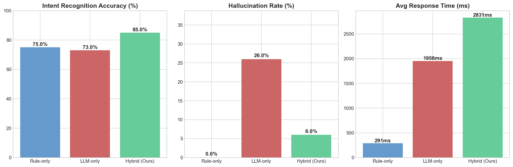

# Hybrid Chatbot AI

AI 기반 의도 분류 및 임베딩 생성 API 서버입니다. Strategy Pattern을 활용하여 RAG(Retrieval-Augmented Generation) 모드와 No-RAG 모드를 동적으로 전환할 수 있는 하이브리드 챗봇 시스템입니다.

## 프로젝트 개요

### 배경 및 목적
기존 챗봇 시스템의 한계를 해결하기 위해 개발된 프로젝트입니다:
- **문제점**: 단순한 규칙 기반(Rule-only) 챗봇은 복잡한 의도 분류에 한계가 있고, LLM-only 방식은 환각(Hallucination) 위험이 높음
- **해결책**: LLM과 RAG를 결합한 하이브리드 접근 방식으로 정확도 향상 + 환각 억제
- **차별점**: 상황에 따라 RAG/No-RAG 모드를 동적으로 선택하여 성능과 비용 최적화

### 핵심 성과
- **Strategy Pattern**을 통한 확장 가능한 아키텍처 설계
- **FAISS 벡터 검색**을 활용한 고속 유사도 검색 구현
- **3-Way 비교 실험** (100개 질의)으로 시스템 우수성 정량적 검증
- **Docker 컨테이너화**를 통한 배포 자동화

## 3-Way 비교 실험 결과

100개 테스트 질의(정형/복합/환각유발)를 사용하여 Rule-only, LLM-only, Hybrid RAG 세 가지 시스템을 비교한 실험 결과입니다.

### 종합 성능 비교

| 지표 | Rule-only (Dialogflow*) | LLM-only (GPT-4o) | **Hybrid RAG (Ours)** |
|:---|:---:|:---:|:---:|
| **의도 인식 정확도** | 75.0% | 73.0% | **85.0%** |
| **환각 발생률** | 0.0% | 26.0% | **6.0%** |
| **평균 응답 시간** | ~291ms* | 1,956ms | 2,831ms |

> *Rule-only 응답 시간은 Dialogflow 시뮬레이션 추정치입니다.

### 카테고리별 의도 인식 정확도

| 카테고리 | Rule-only | LLM-only | **Hybrid RAG** |
|:---|:---:|:---:|:---:|
| A_정형 (기본 질문, 40개) | 92.5% | 87.5% | **92.5%** |
| B_복잡 (복합 질문, 35개) | 65.7% | 71.4% | **77.1%** |
| C_환각유발 (함정 질문, 25개) | 60.0% | 52.0% | **84.0%** |

### 분석

- **Hybrid RAG**가 전체 정확도 85%로 가장 높은 성능을 보이며, 특히 환각유발 질문(C 카테고리)에서 84%로 압도적
- **LLM-only**는 환각 발생률 26%로, RAG 없이 LLM만 사용할 때의 위험성을 확인
- **Rule-only**는 환각이 없지만 복잡한 질문에 대한 정확도가 낮음 (60~66%)
- Hybrid RAG는 RAG 검색 비용으로 응답 시간이 다소 길지만, 정확도와 환각 억제 면에서 최적의 균형점



## 주요 기능

- **하이브리드 의도 분류**: RAG 모드와 No-RAG 모드를 동적으로 선택하여 사용자의 질문 의도를 분류
- **벡터 검색 기반 RAG**: FAISS를 활용한 고속 유사도 검색으로 관련 문서를 검색하여 정확도 향상
- **임베딩 생성 API**: 텍스트를 벡터로 변환하는 임베딩 생성 엔드포인트 제공
- **전략 패턴 구현**: 확장 가능한 아키텍처로 새로운 분류 전략을 쉽게 추가 가능
- **RESTful API**: FastAPI 기반의 자동 문서화된 API 제공
- **성능 평가 도구**: 100개 테스트 데이터셋 + 3-Way 비교 실험 + 환각 판정 시스템

## 기술 스택

### Backend
- **Python 3.12**: 최신 Python 버전, 타입 힌팅 지원
- **FastAPI**: 고성능 비동기 웹 프레임워크, 자동 API 문서 생성
- **Uvicorn**: ASGI 서버, 비동기 처리 지원

### AI/ML
- **OpenAI GPT-4o**: 의도 분류를 위한 LLM
- **LangChain**: LLM 애플리케이션 구축 프레임워크
- **FAISS**: Facebook AI Similarity Search - 벡터 유사도 검색 라이브러리
- **OpenAI Embeddings (text-embedding-3-small)**: 텍스트 임베딩 생성

### 인프라 & DevOps
- **Docker & Docker Compose**: 컨테이너화 및 배포 자동화

### 기타
- **Pydantic**: 데이터 검증 및 타입 안정성
- **python-dotenv**: 환경 변수 관리
- **Matplotlib**: 실험 결과 시각화

## 아키텍처 설계

### 디자인 패턴: Strategy Pattern

이 프로젝트의 핵심은 **Strategy Pattern**을 활용한 확장 가능한 아키텍처입니다:

```
ClassificationStrategy (추상 클래스)
    ├── RagStrategy: RAG를 활용한 의도 분류
    │   ├── FAISS 벡터 검색으로 관련 문서 검색
    │   ├── 검색된 문서를 컨텍스트로 활용
    │   └── GPT-4o로 의도 분류 수행
    │
    └── NoRagStrategy: RAG 없이 LLM만으로 의도 분류
        ├── 빠른 응답 시간
        └── LLM의 기본 능력 활용

StrategyFactory: 모드에 따라 적절한 전략 인스턴스 생성
```

### 기술 선택 이유

1. **FastAPI**: 비동기 처리, 자동 API 문서 생성, Pydantic 타입 안정성
2. **FAISS**: 메모리 기반 벡터 검색으로 빠른 응답, LangChain과의 원활한 통합
3. **Strategy Pattern**: 새로운 분류 전략 추가 용이, 런타임 전략 선택 가능

## 프로젝트 구조

```
hybrid-chatbot-ai/
├── app/
│   ├── main.py                    # FastAPI 애플리케이션 메인 파일
│   └── strategies/
│       ├── base.py                # 추상 전략 클래스
│       ├── factory.py             # 전략 팩토리
│       ├── rag_strategy.py        # RAG 기반 의도 분류 전략
│       └── no_rag_strategy.py     # No-RAG 기반 의도 분류 전략
├── knowledge/                     # 지식 베이스 문서 (RAG용, 10개)
│   ├── refund_procedure.txt       # 환불 정책
│   ├── exchange_policy.txt        # 교환 정책
│   ├── delivery_policy.txt        # 배송 정책
│   ├── order_cancel_policy.txt    # 주문 취소 정책
│   ├── coupon_policy.txt          # 쿠폰/세일 정책
│   ├── vip_policy.txt             # VIP 등급 정책
│   ├── point_policy.txt           # 적립금 정책
│   └── ...
├── faiss_index/                   # FAISS 벡터 인덱스 (생성 필요)
├── create_vectorstore.py          # 벡터스토어 생성 스크립트
├── run_server.py                  # 서버 실행 스크립트
├── run_3way_experiment.py         # 3-Way 비교 실험 스크립트
├── auto_label_hallucination.py    # 자동 환각 레이블링 스크립트
├── analyze_results.py             # 결과 분석 + 차트 생성
├── test_dataset.csv               # 100개 테스트 데이터셋
├── ground_truth_db.json           # 정답 DB (환각 판정 기준)
├── intent_list.json               # 인텐트 목록
├── requirements.txt               # Python 의존성
├── Dockerfile                     # Docker 이미지 설정
├── docker-compose.yml             # Docker Compose 설정
└── README.md
```

## 빠른 시작

### 1. 저장소 클론

```bash
git clone https://github.com/your-username/hybrid-chatbot-ai.git
cd hybrid-chatbot-ai
```

### 2. 환경 변수 설정

```bash
cp env.example .env
# .env 파일을 열어 OPENAI_API_KEY를 설정하세요
```

### 3. 의존성 설치

```bash
pip install -r requirements.txt
```

### 4. 벡터스토어 생성

```bash
python create_vectorstore.py
```

### 5. 서버 실행

```bash
python run_server.py
```

서버가 실행되면 다음 URL에서 접근할 수 있습니다:
- API 서버: `http://localhost:8000`
- API 문서 (Swagger UI): `http://localhost:8000/docs`

## Docker를 사용한 실행

```bash
# Docker Compose 사용 (권장)
docker-compose up -d

# 또는 직접 빌드
docker build -t hybrid-chatbot-ai .
docker run -p 8000:8000 --env-file .env hybrid-chatbot-ai
```

## API 사용법

### 1. 의도 분류 API

**엔드포인트**: `POST /zeroshot-intent`

```json
// 요청
{
  "user_question": "쿠폰과 세일을 동시에 사용할 수 있나요?",
  "intent_list": ["쿠폰_및_세일_중복적용_문의", "특별세일_상품_환불_문의", "VIP_정책_문의"],
  "mode": "rag"
}

// 응답
{
  "final_intent": "쿠폰_및_세일_중복적용_문의",
  "bot_response": "'rag' 모드로 '쿠폰_및_세일_중복적용_문의' 분류됨",
  "engine": "strategy-rag"
}
```

- `rag`: FAISS 벡터 검색을 통해 관련 문서를 검색한 후 의도 분류 (더 정확)
- `no_rag`: LLM의 기본 능력만으로 의도 분류 (더 빠름)

### 2. 임베딩 생성 API

**엔드포인트**: `POST /embed`

```json
// 요청
{ "texts": ["쿠폰과 세일을 동시에 사용할 수 있나요?"] }

// 응답
{ "embeddings": [[0.123, -0.456, 0.789, ...]] }
```

### 3. 헬스 체크

**엔드포인트**: `GET /`

## 실험 재현

### 3-Way 비교 실험 실행

```bash
# 1. 서버 실행 (터미널 1)
python run_server.py

# 2. 실험 실행 (터미널 2, ~30-60분 소요)
python run_3way_experiment.py

# 3. 환각 자동 레이블링
python auto_label_hallucination.py

# 4. 결과 분석 + 차트 생성
python analyze_results.py
```

## 환경 변수

| 변수명 | 설명 | 필수 | 기본값 |
|--------|------|:---:|--------|
| `OPENAI_API_KEY` | OpenAI API 키 | O | - |
| `PORT` | 서버 포트 | | 8000 |
| `WORKERS` | 워커 프로세스 수 | | 1 |
| `LOG_LEVEL` | 로그 레벨 | | info |

## 보안

- `.env` 파일은 `.gitignore`에 포함되어 Git에 커밋되지 않음
- 배포 스크립트에는 플레이스홀더만 포함 (실제 API 키 없음)
- CORS는 개발 환경에서 모든 origin 허용, 프로덕션에서는 제한 필요

## 지식 베이스 관리

`knowledge/` 폴더에 `.txt` 파일을 추가하여 지식 베이스를 확장할 수 있습니다. 새로운 문서를 추가한 후 벡터스토어를 재생성하세요:

```bash
python create_vectorstore.py
```

## 향후 개선 계획

- [ ] 캐싱 시스템 도입 (Redis)
- [ ] 멀티 모델 지원 (GPT-4o 외 Claude, Gemini 등)
- [ ] 실시간 스트리밍 (SSE)
- [ ] API 키 기반 인증 시스템
- [ ] Unit Test 및 Integration Test
